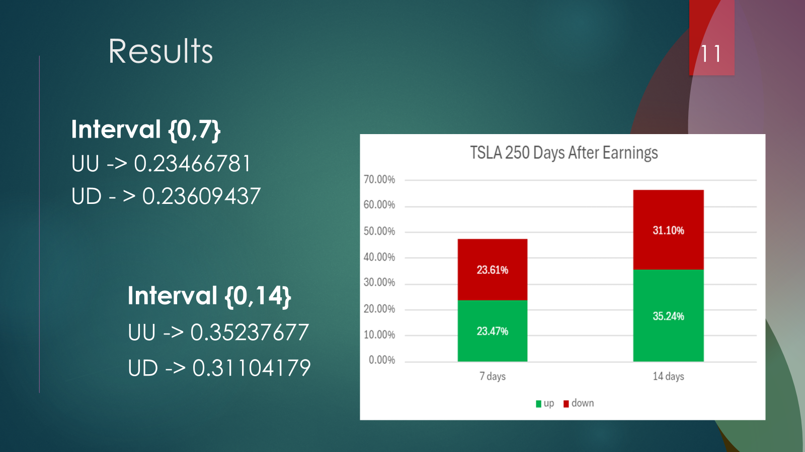

# Computer Scientist Student

#### Technical Skills: Python, C++, Stock Market Analysis

## Education
- B.S. in Computer Science | Morehouse College (Graduating 2026)
- GPA: 3.5/4.0.

## Work Experience
**A Fellow @ Morehouse Community Data Fellowship (Aug 2023-December 2023)**
- Managed the merging and creation of a universal dataset to analyze fatal police shootings in the United States.
- Identified and solved issues between the data collection team and merging teams.
- Collaborated with merging team to transition from R to Python.

**Research Software Engineer Intern	@ Archaeologic, Inc. (May 2023-Feb 2024)**
- Improved the processes of generating reports for clients, specifically adding Markdown features for clarity.
- Collaborate with teams to produce monthly reports with accurate financial status and issues closed during the reporting period.
- Led the transition from the Plantuml scripting language to Mermaid, simplifying the future creation of class and sequence diagrams. 

**A Participant @ SLMath MAY-UP (May 2024)**
- Collaborated with a team on a research/computational project, and enhanced Python skills.
- Studied numerical linear algebra and applied it to AI and Machine Learning concepts.
- Developed and delivered a stock price prediction model utilizing Markov chains and NumPy.

## Projects
### [Stock Market Prediction Model Using Markov Chains](./projects/stock_market/stock_movement_odds.py)
This project uses Markov chains to analyze stock price movements and predict the odds (not probabilities) that a stock will move up or down over a given time frame. By focusing on **odds**, the model outputs two distinct numbers representing the likelihood of the stock going up or down, which do not sum to 1 like probabilities would.

As a case study, I applied this model to Tesla (TSLA), specifically analyzing its price action around quarterly earnings announcements. Knowing the volatility and market activity surrounding Tesla's earnings, I sought to see if the model could reflect real-world fluctuations:

[View Code For Tesla Predictions Around Earnings](./projects/stock_market/tesla_earnings_odds.py)

- 7 Days Post-Earnings: The odds of Tesla being up or down are nearly identical, reinforcing the assumption that short-term trading after earnings resembles a 50/50 chance, akin to flipping a coin.

- 14 Days Post-Earnings: After extending the time horizon, the odds of the stock being up significantly increase. This aligns with the idea that as volatility and FOMO (fear of missing out) decrease, investors start to see Tesla's value as a growth stock.

### Stock Price Prediction using machine Learning..
