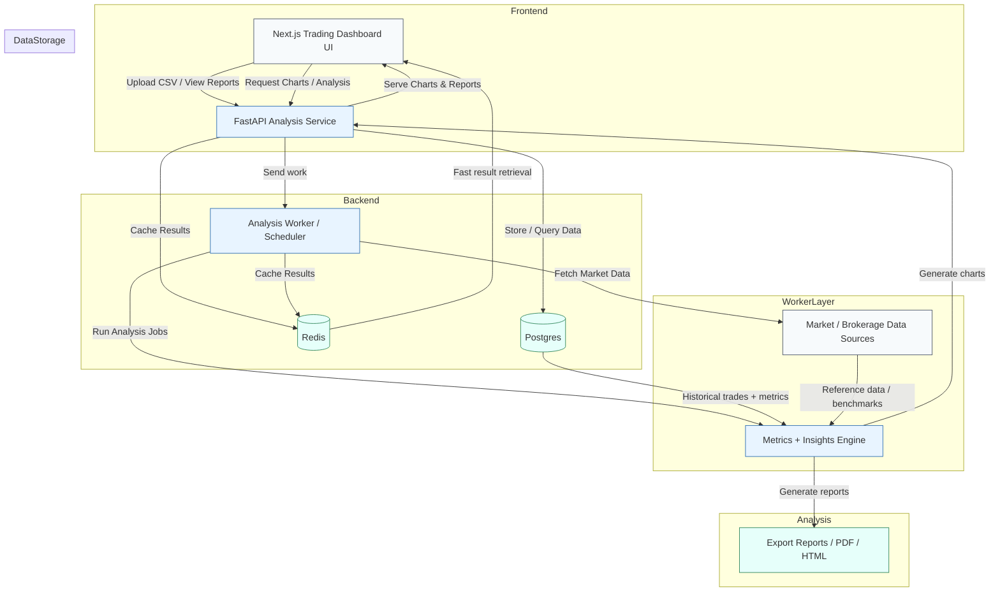

# Trading Analysis Plan

## Visual Architecture Diagram

## Key Components

- **Frontend**: Next.js app with upload forms, chart display, and report viewer.
- **Backend**: FastAPI service for ingesting trade history, validating data, and requesting analysis.
- **Worker Layer**: Background analysis jobs and scheduled runs to compute metrics and generate visual summaries.
- **Storage**: Postgres for raw trade history and computed metrics, Redis for caching dashboards and intermediate results.
- **Analysis Engine**: Data processing, KPI calculation, strategy performance evaluation, and chart/report creation.

## Goals

- Produce a scalable, web-ready trading analysis dashboard.
- Make the system modular so you can add new analysis types without rewriting the full stack.
- Keep the frontend/backend/worker separation clear for easier deployment.
